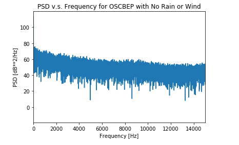
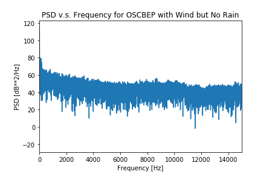
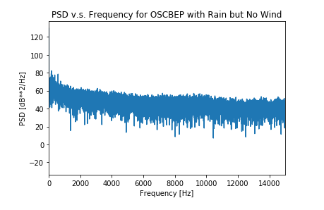
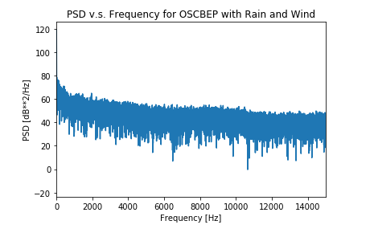
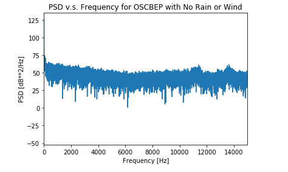
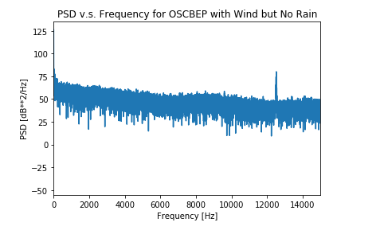
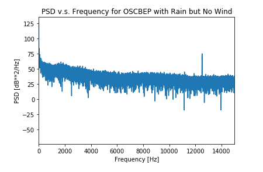

# BME-450-Project-4

Code Link: 

# Problem Statement:

For this project, we need to once again visit the OOI website and pull hydrophone broadband data for Oregon Shelf Cabled Benthic Experiment Package and Oregon Offshore Cabled Benthic Experiment Package. Using our results from Project 2, we will identify four time periods: when it is neither rainy nor windy, when it is windy but not rainy, when it is rainy but not windy, and when it is both windy and rainy. We then need to read that data and use it to calculate the power spectral density, then convert the PSD into decibels. For both locations and all four conditions, we need to plot the PSD against frequency, then answer several questions about the effect of wind, rain, and location on underwater sound.

For the second part of the project, we need to read data from the OOI website that contain each of three audio sources: a marine mammal vocalization, an airgun firing, and an earthquake. We need to plot a spectrogram of these sounds, and discuss the bandwidth of the signal and compare it to the Wenz curve to check consistency with what we expect.

# The Code:

We start by copying in URLs to data packagaes on the OOI raw data server, which are found using the results of Project 2. We then read the data and assign it to the relevant variables. We are able to read the sampling rate and start time from the data stream and set an end time based off of that. Using these we create a slice of the data from our set start to end time, and find the one second segment of the time series from the one second slice. Using a given equation, we can find the PSD of the signals and convert that into decibels. Finally we plot the PSD against frequency for each of the conditions for both locations.

For the second part of the project, we once again copy in URLs to the data stream for the sound we need. We can read the sampling rate and start time again, and set our desired end time for the slice. Using our given equations again, we can plot a spectrogram of time against frequency for each of the three audio sources.

# Results:

# Questions:

1) What is the effect of wind and rain on underwater noise? Explain any behavior you see in your result.

2) Which one has the highest impact? Rain or wind?

3) What are the main reasons for observing different spectral levels in Oregon shelf compared to Oregon offshore?

4) Compare the bandwidth of these three signals. Are they consistent with what is shown in the Wenz curve?

# Conclusion:

# References:

