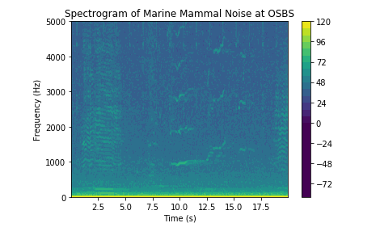
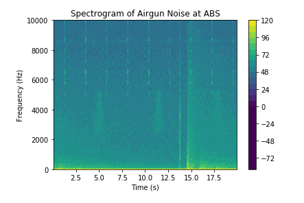
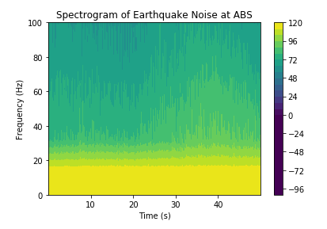

# BME-450-Project-4

Code Link: https://github.com/SamEF99/BME-450-Project-4/blob/master/BME%20450%20Project%20%234.ipynb

# Problem Statement:

For this project, we need to once again visit the OOI website and pull hydrophone broadband data for Oregon Shelf Cabled Benthic Experiment Package and Oregon Offshore Cabled Benthic Experiment Package. Using our results from Project 2, we will identify four time periods: when it is neither rainy nor windy, when it is windy but not rainy, when it is rainy but not windy, and when it is both windy and rainy. We then need to read that data and use it to calculate the power spectral density, then convert the PSD into decibels. For both locations and all four conditions, we need to plot the PSD against frequency, then answer several questions about the effect of wind, rain, and location on underwater sound.

For the second part of the project, we need to read data from the OOI website that contain each of three audio sources: a marine mammal vocalization, an airgun firing, and an earthquake. We need to plot a spectrogram of these sounds, and discuss the bandwidth of the signal and compare it to the Wenz curve to check consistency with what we expect.

# The Code:

We start by copying in URLs to data packagaes on the OOI raw data server, which are found using the results of Project 2. We then read the data and assign it to the relevant variables. We are able to read the sampling rate and start time from the data stream and set an end time based off of that. Using these we create a slice of the data from our set start to end time, and find the one second segment of the time series from the one second slice. Using a given equation, we can find the PSD of the signals and convert that into decibels. Finally we plot the PSD against frequency for each of the conditions for both locations.

For the second part of the project, we once again copy in URLs to the data stream for the sound we need. We can read the sampling rate and start time again, and set our desired end time for the slice. Using our given equations again, we can plot a spectrogram of time against frequency for each of the three audio sources.

# Results:

# Questions:

1) What is the effect of wind and rain on underwater noise? Explain any behavior you see in your result.

When rain and wind are present at sea, we expect an increase in underwater noise levels. Wind will cause larger waves and a large rate of surface breaking, creating large amounts of bubbles that collapse. Rain will similarly create bubbles when it disturbs the surface. Looking at our plots, when wind is present, we see a large increase in the PSD at very low frequencies, and an overall increase in PSD for the whole signal. When rain is present, we see the same increase in PSD at low frequency, as well as a smaller overall range is PSD values. When we have both, we see the low frequency increase and overall increase, but not the range decrease.

2) Which one has the highest impact? Rain or wind?

Wind has a greater impact on the signal when compared to rain. From a general standpoint, greater wind speeds will change the wave formations and the rate of surface breaking, causing a large amount of underwater noise compared to rainfall. Looking at our plot, we see that when wind is present without rain, there is an overall increase in the average PSD, as well as an increase in PSD at low frequency. When only rain is present, we do not see that overall increase in the average PSD. 

3) What are the main reasons for observing different spectral levels in Oregon shelf compared to Oregon offshore?

The two sites are at vastly different depths, which will change the spectral density of the signal. The Oregon Shelf CBED is around 80m in depth, while the Oregon Offshore CBED is around 550m in depth. They also have different upwell characteristics in their areas. This is the main reason for the differences we see in the signal. The effect of wind and rain on the underwater noise will also decrease at greater depths.

4) Compare the bandwidth of these three signals. Are they consistent with what is shown in the Wenz curve?

The bandwidth of the signals is consistent with the Wenz curve. Marine mammal vocalizations are anywhere between 10 and 100,000 Hz, and we see them between our 0-5000 Hz range. Airgun sounds should be between 100-10,000 Hz, and we see them around 5000-10,000 Hz. Earthquake signals should be very low, between 0 and 100 Hz, and we see them in this exact range. This supports the accuracy of the hydrophone system, and that our signals represent what we say they do.

# Conclusion:

In this project, we pulled hydrophone broadband data from the OOI raw data server for several different arrays. We used this data to first calculate PSD and plot it against frequency for the Oregon Shelf CBED and Oregon Slope CBED for four conditions: no wind or rain, wind but no rain, rain but no wind, and both wind and rain. We then also found data where there were marine mammal vocalizations, airgun sounds, and an earthquake, and plotted a spectrogram of the signal. We then dicussed how wind and rain affect underwater noise and which affects it more, the reason we see different spectral density levels at different locations, and compared the broadband levels of the different noises and checked them against the Wenz curve. We found that wind affects PSD more, suggested that the difference in PSD levels is due to variable depth, and found that the broadband levels matched what we would expect.

# References:

https://rawdata.oceanobservatories.org/files/CE02SHBP/LJ01D/11-HYDBBA106/

https://rawdata.oceanobservatories.org/files/CE04OSBP/LJ01C/11-HYDBBA105/

https://rawdata.oceanobservatories.org/files/RS01SLBS/LJ01A/09-HYDBBA102/

https://rawdata.oceanobservatories.org/files/RS03AXBS/LJ03A/09-HYDBBA302/
